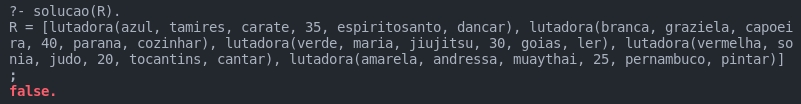

# Puzzle Solver Example

An example of how to use Prolog to solve logic puzzles

## The Puzzle

The puzzle is [Artes Marciais](https://rachacuca.com.br/logica/problemas/artes-marciais/)
And it consists of a grid of 5 columns (Fighters) and 6 rows (Categories), and an equal number of
options within each category that is equal to the number of Fighters. Each option must be used only once.
And the goal is to fill all rows for each fighter based on the clues.


### The Solution

In prolog, therefore, each option of each category became a fact, and each aspect of the clues became a rule. So if a clue said that
a fighter was on the side of another one it is necessary to implement a rule that verifies that for any fighters.

## How to run it

You can use swipl to run it, first compile:

```swipl
?- ['path/to/file.pl'].
```

and then ask the query:

```swipl
?- solucao(R).
```

The solution:



We use ; to see if there is any other answer, but it returns false, meaning it doens't have any.
